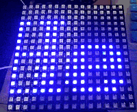

# ESP8266/ESP32 neopixel 16x16 display drive




## API

* **set(n, color='')**  
set LED[n] to color  
n: 0-255  
color: LED color. if color is not given, it will using default color  

* **clear()**  
clear all LED  

* **setcolor(color)**  
set display color  

* **show(self, dat, offset=0, clear = True, color='')**  
show text or emijo.  
dat:    text or emijo data  
offset: display offset  
clear:  clear the display before show  
color:  new color  

## example


```
from machine import Pin
import time

from neo16x16 import neo16x16

np = neo16x16(Pin(2))

npdat=[
0x2008,0x1FFC,0x3FF8,0x1084,0x0100,0x1084,0x3FF8,0x1FFC,
0x2008,0x0000,0x1F00,0x01FC,0x2480,0x0124,0x2480,0x01EC,
0x1700,0x0000,0x0000,0x0804,0x2010,0x1FFC,0x3FF8,0x0004,
0x2000,0x0000,0x0000,0x0000,0x2010,0x0804,0x3FF8,0x1FFC,
0x2000,0x0004,0x0000,0x0000,0x0000,0x00F8,0x3F80,0x0104,
0x2080,0x0104,0x3F80,0x00F8,0x0000,0x0080,0x0180,0x0700,
0xFFF8,0xFFFF,0x1047,0x0638,0x0F38,0xF8C2,0xC00F,0x13FF,
0x7FC8,0x1080,0x0728,0x1C78,0x1818,0x0000,0x4010,0x0846,
0x37F0,0xFFB8,0x1E1F,0x0FEE,0x61F0,0x0100,0x4082,0x4103,
0xFFE2,0x4FFE,0x009A,0x7100,0x0086,0x0100,]   

n = 0
while 1:
    np.show(npdat, n)
    n = (n + 1)%70
    time.sleep_ms(200)

```

From microbit/micropython Chinese community  
www.micropython.org.cn